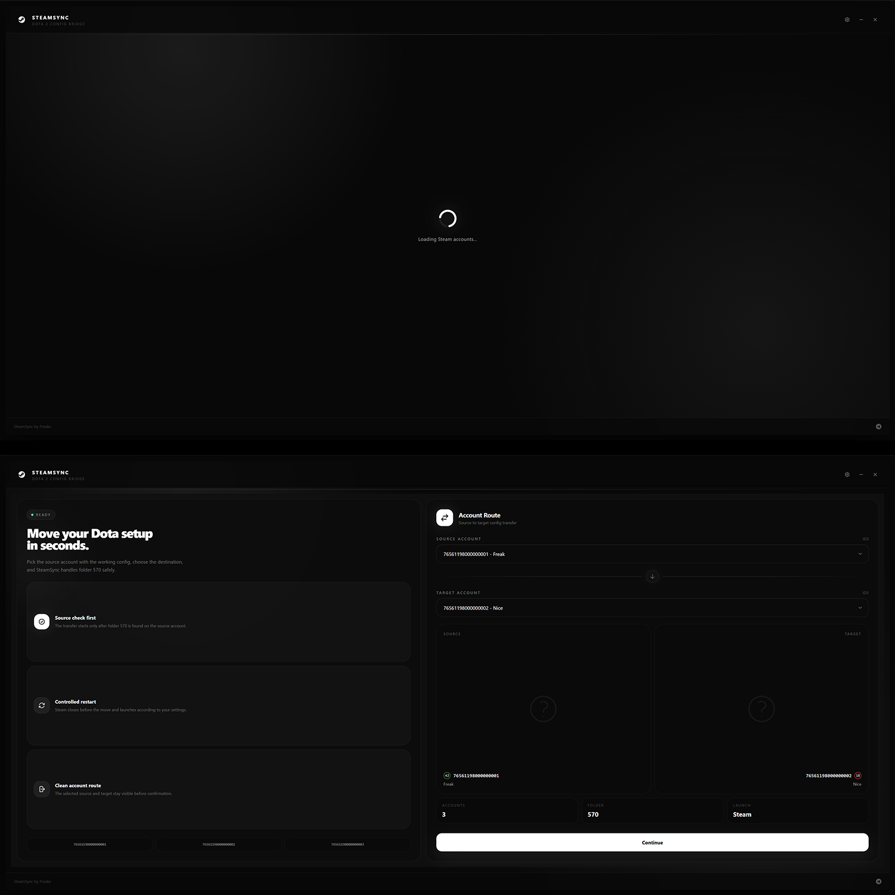
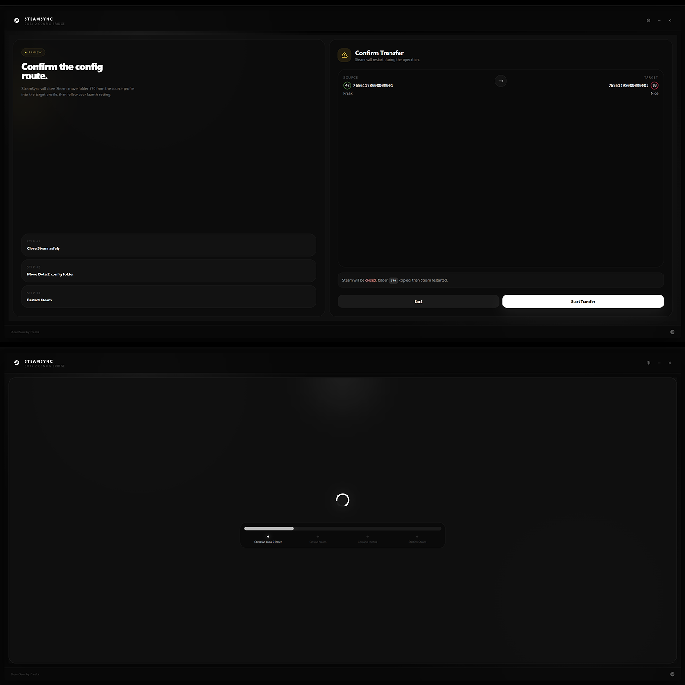
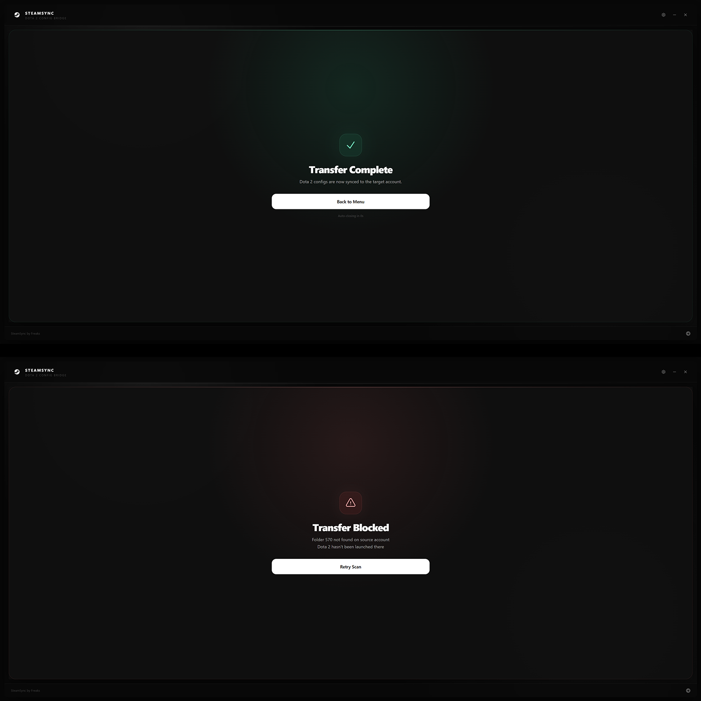

## Возможности

- **Автоопределение Steam** — приложение само находит папку `userdata` и все аккаунты
- **Подгрузка профилей** — отображает никнейм, аватар и уровень Steam для каждого аккаунта
- **Проверка папки 570** — перед переносом проверяет, что на исходном аккаунте запускали Dota 2
- **Steam** — автоматически закрывает и перезапускает Steam во время переноса
- **Umbrella** — опциональный запуск UmbrellaLoader после переноса

---

## Скриншоты







---

## Установка

### Готовая сборка

Готовая portable-версия (`SteamSync.exe`) доступна в разделе [Releases](https://github.com/freakks/sync/releases).

### Сборка из исходников

**Требования:**
- [Node.js](https://nodejs.org/) 18+
- npm 9+

```bash
# 1. Клонируем репозиторий
git clone https://github.com/freakks/sync.git
cd sync

# 2. Устанавливаем зависимости
npm install

# 3. Режим разработки (горячая перезагрузка)
npm run dev

# 4. Собираем portable .exe
npm run release
```

После `npm run release` готовый файл `SteamSync 1.0.1.exe` появится в папке `dist/`.

---

## Как пользоваться

1. Запусти SteamSync
2. Приложение само просканирует все Steam-аккаунты и загрузит их профили
3. В левой колонке выбери **Source Account** (откуда берём конфиги)
4. В правой колонке выбери **Target Account** (куда переносим)
5. Нажми **Continue** — приложение проверит наличие папки 570
6. Подтверди перенос на экране **Confirm Transfer**
7. SteamSync закроет Steam, переместит папку, запустит Steam обратно

---

## TODO

- [❌] Кастом темы
- [❌] Шеринг конфигов
- [❌] Локализация

---

## Связь

- Telegram: [@steamsync](https://t.me/steamsync)
